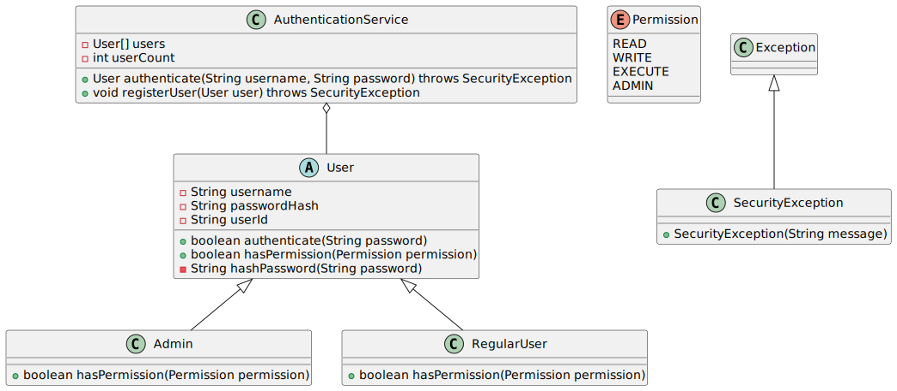

# Système d'authentification

## Objectif

Créer un système d'authentification simple qui implémente le contrôle d'accès des utilisateurs.
Le système doit gérer deux types d'utilisateurs : administrateur et utilisateur régulier avec
différents niveaux de permissions. Il faudra également implémenter une gestion appropriée des
exceptions pour les problèmes liés à la sécurité.

## Diagramme de classes

Les classes à définir pour ce système sont les suivantes : 



## Travail demandé

### 1. Classe abstraite `User`

Créez une classe abstraite `User` qui :

- stocke le nom de l'utilisateur (`username`), la valeur de hachage du mot de passe (`passwordHash`), et un identifiant unique (`userId`) ;
- fournit des fonctionnalités d'authentification au travers de la méthode `authenticate()` ;
- possède une méthode abstraite pour la vérification des permissions `hasPermission(Permission permission)` ;
- utilise l'algorithme [SHA-256](https://fr.wikipedia.org/wiki/SHA-2) pour hacher les mots de passe ;
- implémente un constructeur qui prend en paramètre un nom d'utilisateur et un mot de passe.

**Méthodes importantes** :

```java
public boolean authenticate(String password) /* Vérifie si le mot de passe fourni correspond au hash stocké */
public abstract boolean hasPermission(Permission permission) /* Vérifie si l'utilisateur a la permission spécifiée */
```

Le calcul de la valeur de hachage se fera à l'aide de la méthode privée `hashPassword()` suivante :

```java
import java.security.MessageDigest;
import java.security.NoSuchAlgorithmException;
import java.nio.charset.StandardCharsets;

private String hashPassword(String password) {
    try {
        /* Utiliser l'algorithme SHA-256 */
        MessageDigest digest = MessageDigest.getInstance("SHA-256");
        
        /* Appliquer l'algorithme au mot de passe */
        byte[] hashBytes = digest.digest(password.getBytes(StandardCharsets.UTF_8));
        
        /* Convertir le tableau d'octets en représentation hexadécimale */
        StringBuilder hexString = new StringBuilder();
        for (byte b : hashBytes) {
            String hex = Integer.toHexString(0xff & b);
            if (hex.length() == 1) {
                hexString.append('0');
            }
            hexString.append(hex);
        }
        
        return hexString.toString();
        
    } catch (NoSuchAlgorithmException e) {
        /*
         * Dans un système réel, il faudrait gérer cette exception correctement
         * Pour cet exercice, une simple conversion en RuntimeException est suffisante
         */
        throw new RuntimeException("Algorithme de hachage non disponible", e);
    }
}
```

### 2. Enum `Permission`

Créez une énumération `Permission` qui définit les niveaux d'accès suivants :

- `READ` : permission de lecture ; 
- `WRITE` : permission d'écriture ;
- `EXECUTE` : permission d'exécution ;
- `ADMIN` : permission d'administration (niveau le plus élevé).

### 3. Classes d'utilisateurs

Implémentez deux classes qui héritent de `User` :

#### `Admin`

- Un administrateur qui a toutes les permissions possibles.
- Sa méthode `hasPermission()` doit toujours retourner `true`, quelle que soit la permission demandée.

#### `RegularUser`

- Un utilisateur régulier qui n'a que des permissions limitées (`READ` et `EXECUTE`).
- Sa méthode `hasPermission()` doit retourner `true` uniquement pour les permissions `READ` et `EXECUTE`.

### 4. Classe `AuthenticationService`

Implémentez une classe de service qui :

- gère une liste d'utilisateurs ;
- permet d'enregistrer de nouveaux utilisateurs ;
- Permet d'authentifier les utilisateurs existants ;
- lance des exceptions appropriées pour les problèmes de sécurité.

**Méthodes importantes** :

```java
/*
 * Authentifie un utilisateur en vérifiant son nom d'utilisateur et son mot de passe.
 * Lance une SecurityException si l'authentification échoue.
 */
public User authenticate(String username, String password) throws SecurityException

/*
 * Enregistre un nouvel utilisateur.
 * Vérifie si le nom d'utilisateur existe déjà.
 */
public void registerUser(User user)
```

### 5. Classe `SecurityException`

Créez une classe d'exception personnalisée qui :

- hérite de la classe `Exception` ;
- permet de signaler des erreurs liées à la sécurité comme :
  - échec d'authentification ;
  - utilisateur non trouvé ;
  - tentative d'accès non autorisée.

## Conseils d'implémentation

1. La classe `java.util.UUID` permet de générer des identifiants uniques.
2. Assurez-vous que votre système empêche les doublons de noms d'utilisateurs.
3. Vérifiez le bon fonctionnement de votre système à l'aide des tests fournis.

## Références

1. **`UUID`**
   - [Documentation officielle Java](https://docs.oracle.com/javase/8/docs/api/java/util/UUID.html)
   - [tutorialspoints.com](https://www.tutorialspoint.com/java/util/java_util_uuid.htm)
2. **`MessageDigest`**
   - [Documentation officielle Java](https://docs.oracle.com/javase/8/docs/api/java/security/MessageDigest.html)
   - [tutorialspoints.com](https://www.tutorialspoint.com/java_cryptography/java_cryptography_message_digest.htm)
